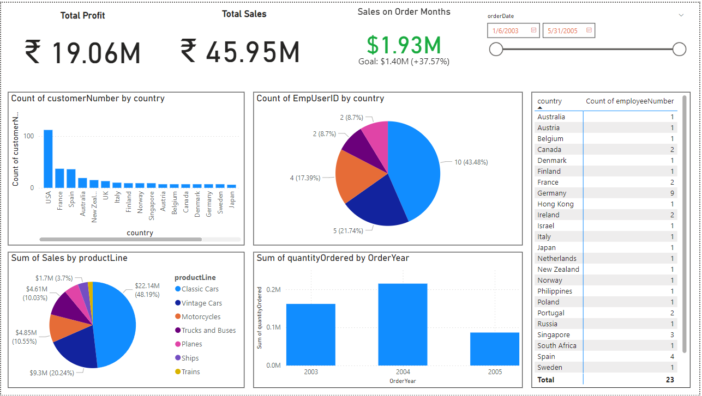
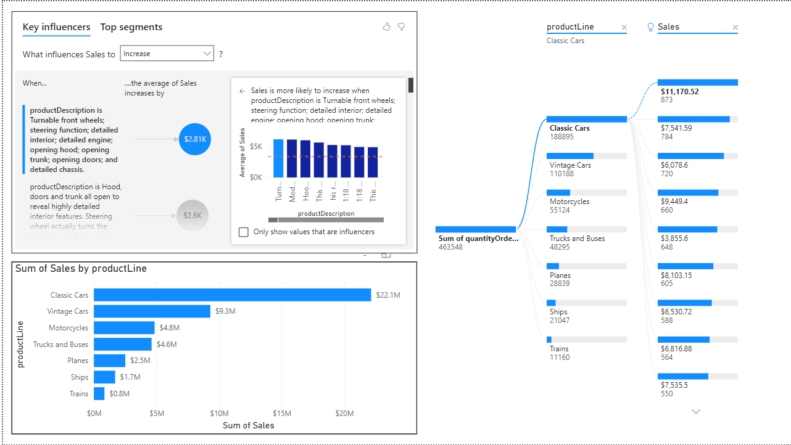

# Business Sales Insights Dashboard

## Overview
This repository showcases a Power BI dashboard designed for analyzing business sales data. By leveraging multiple datasets, the dashboard provides key insights into overall sales performance, profitability, and trends over time.

## Dataset
The dataset includes the following tables:
- **Customers**: Information about the customers.
- **Employees**: Data about employees and their roles.
- **Offices**: Details of office locations.
- **Order Details**: Specifics about items ordered, quantities, and prices.
- **Orders**: High-level order information including dates and customers.
- **Payments**: Payment transactions and related details.
- **Product Lines**: Categories of products offered.
- **Products**: Detailed product information including names and prices.

## Key Features
1. **Total Profit**: Visualizes the total profit generated across all sales.
2. **Total Sales**: Displays overall revenue figures.
3. **Sales by Month**: Highlights monthly sales trends for better understanding of seasonality.
4. **Sales Analysis by Dimensions**:
   - **Key Influencers**: Identifies factors that drive sales performance.
   - **Decomposition Tree**: Breaks down sales and profit data by different attributes for granular analysis.
5. **Category and Product-Level Insights**:
   - Stacked and clustered bar charts for comparing sales across categories, regions, and products.
   - Pie charts for visualizing proportions of sales by product lines or other dimensions.

## Visualizations
The following visualizations were used to present insights:
- **Stacked Chart**: To compare sales and profits across multiple dimensions.
- **Pie Chart**: For proportional analysis of product lines and categories.
- **Key Influencers**: To determine significant drivers of business success.
- **Decomposition Tree**: For detailed breakdown of performance metrics.
- **Cards**: To highlight key KPIs such as total profit and total sales.
- **Clustered Bar Chart**: For side-by-side comparisons of sales performance.

## Screenshots
### Main Dashboard Views

## Tools & Technologies
- **Power BI**: For data modeling, analysis, and visualization.
- **DAX**: To create measures and calculated columns for deeper insights.

## Learnings
Through this project, I developed skills in:
- Connecting and modeling data from multiple related tables.
- Creating insightful and interactive dashboards with Power BI.
- Using advanced visualizations like Decomposition Tree and Key Influencers.

## Future Enhancements
- Add predictive analytics to forecast future sales trends.
- Include customer segmentation analysis for targeted marketing strategies.
- Enhance interactivity with more slicers and drill-through capabilities.

## How to Use
1. Download the Power BI file (`BusinessSales.pbix`) and open it using Power BI Desktop.
2. Explore the dashboard to gain insights into sales performance and profitability.
3. Customize the visuals or metrics as per your business needs.

## Contact
Feel free to connect with me on [LinkedIn](https://www.linkedin.com/in/kunalkawate/) for feedback or collaboration opportunities.

## License
This project is licensed under the MIT License - see the LICENSE file for details.
